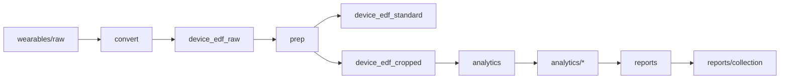

# Running the pipeline

[Back to README](../README.md)

## Minimal script

```python
from nimbalwear import Study

study = Study("/data/MYSTUDY")
study.run_pipeline()
```

This runs every stage listed in `[pipeline] stages` (by default `convert`, `prep`, `analytics`, `reports`) for every
collection in `study/collections.csv`.

## `Study` constructor

```python
Study(study_dir, settings_path=None, create=False)
```

| Parameter | Description |
|---|---|
| `study_dir` | Path to the study folder |
| `settings_path` | Optional TOML file with settings that override the study settings every time this `Study` object runs |
| `create` | Create a new study folder (see [study-setup.md](study-setup.md)) |

## `run_pipeline()` parameters

```python
study.run_pipeline(collections=None, stages=None, settings_path=None, supp_pwd=None,
                   quiet=False, log=True, log_level=logging.INFO)
```

| Parameter | Default | Description |
|---|---|---|
| `collections` | all collections | List of `(subject_id, coll_id)` tuples, for example `[("0001", "01"), ("0002", "01")]` |
| `stages` | `[pipeline] stages` | List of stages to run, in order. See below. |
| `settings_path` | `None` | Path to a TOML file of setting overrides for this run, or `'auto'` to look for a per-collection settings file (see [advanced.md](advanced.md#per-collection-settings)) |
| `supp_pwd` | `None` | Password for an encrypted `supplementary_info.xlsx` |
| `quiet` | `False` | Hide console messages (progress bars are still shown) |
| `log` | `True` | Write log files to `study/logs/` |
| `log_level` | `logging.INFO` | Python logging level, for example `logging.DEBUG` |

Collection IDs are read as text, so pass them as strings (`"01"`, not `1`).

Helper methods:

```python
study.get_collections()   # [(subject_id, coll_id), ...] from collections.csv
study.get_subject_ids()   # unique subject_ids in devices.csv
study.get_coll_ids()      # unique coll_ids in devices.csv
```

## Stages



| Stage | Steps (in order) | Controlled by |
|---|---|---|
| `convert` | Read raw files, check and overwrite headers, de-identify, write EDF to `device_edf_raw/` | `[modules.read]` |
| `prep` | 1. `adj_start`: shift device start times (optional)<br>2. `autocal`: accelerometer auto-calibration<br>3. `sync`: synchronize devices to the first device<br>4. write EDF to `device_edf_standard/`<br>5. `nonwear`: DETACH non-wear detection<br>6. `crop`: crop non-wear at the start and end<br>7. write EDF to `device_edf_cropped/`<br>8. `save_sensors`: per-sensor EDF (optional) | `[modules.prep]` switches plus each module's section |
| `analytics` | 1. `gait`<br>2. `sleep`<br>3. `activity` (uses gait and sleep results from this run) | `[modules.analytics]` switches |
| `reports` | Collection HTML report | `[modules.reports]` |

## Re-running from a later stage

The **first stage** in `stages` decides where device data is read from:

| First stage | Device data read from |
|---|---|
| `convert` | `wearables/raw/` (using `file_name` in `devices.csv`) |
| `prep` | `wearables/device_edf_raw/` |
| `analytics` | `wearables/device_edf_cropped/`, plus cropped non-wear bouts from `analytics/nonwear/bouts_cropped/` |
| `reports` | No device data. The report is built from the saved CSV outputs. |

Examples:

```python
# re-run prep and analytics with new settings, without re-converting raw files
study.run_pipeline(stages=["prep", "analytics"], settings_path="new_nonwear.toml")

# only analytics, for two collections
study.run_pipeline(collections=[("0001", "01"), ("0002", "01")], stages=["analytics"])

# only rebuild reports
study.run_pipeline(stages=["reports"])
```

Stages run in the order you list them, and the order is not checked. Keep them in pipeline order.

## Monitoring runs

**Console.** Progress bars show progress across collections and devices. Unless `quiet=True`, messages are also
printed.

**Log files.** Each collection run writes two files to `study/logs/`:

- `{subject_id}_{coll_id}_{YYYYmmddHHMMSS}.log`: all messages, warnings and error tracebacks
- `{subject_id}_{coll_id}_{YYYYmmddHHMMSS}_settings.txt`: the full settings used for that run, for reproducibility

**Status file.** `study/status.csv` has one row per collection. It records `Success` or `Failed` for `convert`,
`prep` and `analytics`, and also for the individual steps `nonwear`, `crop`, `gait`, `sleep` and `activity`.

When a step fails for an expected reason, such as no ankle device for gait, it is marked `Failed` with a warning in
the log, and the pipeline continues with the next step. Unexpected errors stop processing of that collection. The
traceback is logged and the pipeline moves on to the next collection.

## Common warnings

| Message | Meaning and fix |
|---|---|
| `... does not exist - this device will be excluded` | The file named in `devices.csv` is not in the expected folder. Check `file_name`, or run earlier stages first. |
| `... mismatch: X (header) != Y (device list)` | The file header differs from `devices.csv`. If `overwrite_header = true`, `devices.csv` values are used. |
| `Invalid config time, could not add as sync time` | The reference device's configuration time is after its start time. Config sync is skipped. |
| `No eligible wrist devices found` / `No left or right ankle device found` | No device matches the required type and location aliases for activity/sleep or gait. |
| `does not contain all signals required to detect non-wear` | The device lacks accelerometer or temperature signals (Bittium ECG-only, for example). Non-wear is skipped. |
| `Left and right ankle sample rates do not match` | Gait needs both ankle devices at the same sample rate. |

Also see [limitations.md](limitations.md).

## Batch-processing script example

```python
import logging
from nimbalwear import Study

study = Study("/data/MYSTUDY")

todo = [c for c in study.get_collections() if c[0].startswith("00")]

study.run_pipeline(collections=todo,
                   settings_path="auto",
                   supp_pwd=None,
                   quiet=True,
                   log_level=logging.INFO)
```

Next: [Configuration](configuration.md) · [Outputs](outputs.md)
